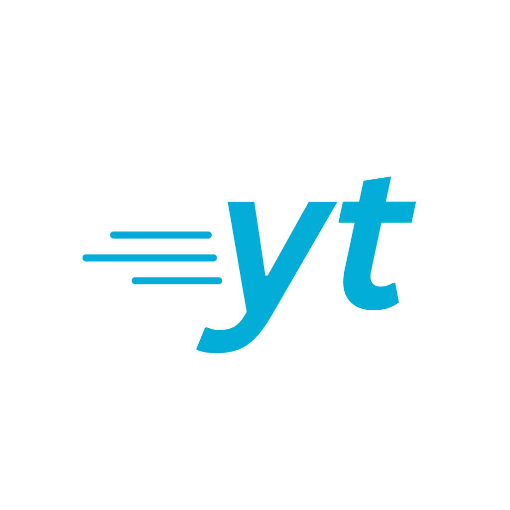

# ytgo-bot

Discord bot to get the URL of the first result from YouTube search

## Usage

1. Create a bot via Discord Developer Portal.

2. From the left list of tabs, select Installation and copy the Install Link.

3. Visit the Install Link in a browser and add your bot to desired server(s) and/or guild(s).
    - Add scope `application.commands` and `bot` with permissions `Send Messages`, `Send Messages in Threads`, and `Use Slash Commands` to the Invite Link before using it (Discord Developer Portal `>` Installation `>` Guild Install)

4. Deploy bot to Azure Container Apps through [portal.azure.com](https://portal.azure.com)
    - Set the `BOT_TOKEN` environment variable to source from a secret storing your bot's token (Discord Developer Portal `>` Bot `>` Token)
    - Azure was chosen here because it's free and doesn't spin down when idle. Feel free to deploy on a platform of your choice.

5. Send `/yt <search terms>` in a server/guild with the bot to return the URL of the first search result on YouTube with the specified query.
